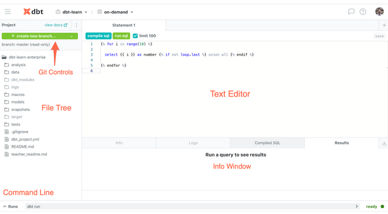
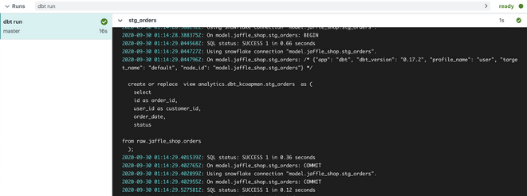
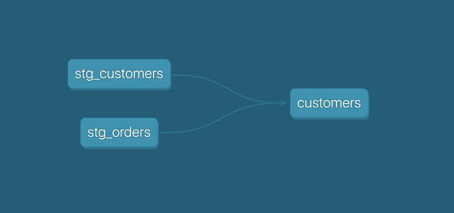
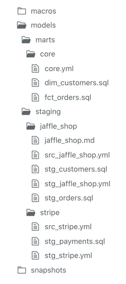
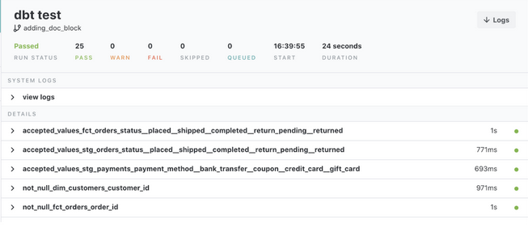
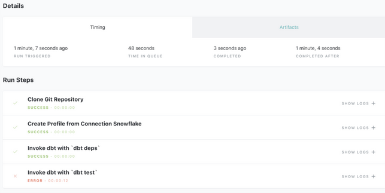
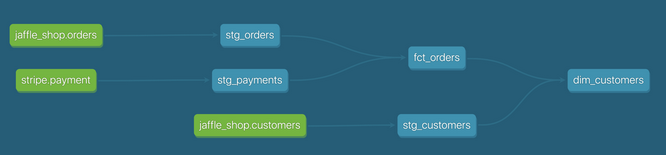
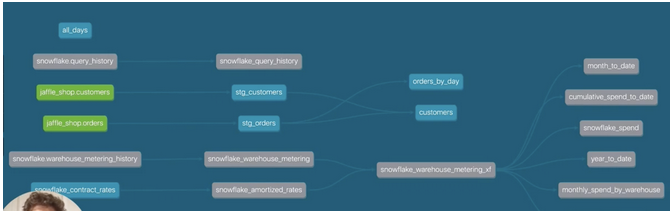

#  Fundamentals
- Learn more about dbt [in the docs](https://docs.getdbt.com/docs/introduction)
- Check out [Discourse](https://discourse.getdbt.com/) for commonly asked questions and answers
- Join the [chat](http://slack.getdbt.com/) on Slack for live discussions and support
- Find [dbt events](https://events.getdbt.com) near you
- Check out [the blog](https://blog.getdbt.com/) for the latest news on dbt's development and best practices
## Table of Contents
- [! Fundamentals](#-fundamentals)
  - [Table of Contents](#table-of-contents)
- [Who is an analytics engineer?](#who-is-an-analytics-engineer)
  - [Traditional Data Teams](#traditional-data-teams)
  - [ETL and ELT](#etl-and-elt)
  - [Analytics Engineering](#analytics-engineering)
  - [dbt](#dbt)
- [Set up dbt Cloud](#set-up-dbt-cloud)
  - [GitHub repository and connection](#github-repository-and-connection)
    - [Create an empty repository over in GitHub](#create-an-empty-repository-over-in-github)
    - [Grant access for dbt Cloud to connect to GitHub](#grant-access-for-dbt-cloud-to-connect-to-github)
  - [Connecting to your warehouse and repository](#connecting-to-your-warehouse-and-repository)
    - [Create a new project](#create-a-new-project)
    - [Connect to your warehouse](#connect-to-your-warehouse)
    - [Connect to your repository](#connect-to-your-repository)
    - [Initialize your project](#initialize-your-project)
  - [Cloud IDE](#cloud-ide)
    - [File tree](#file-tree)
    - [Text editor](#text-editor)
    - [Compile SQL / Run SQL](#compile-sql--run-sql)
    - [Command line](#command-line)
    - [Info window](#info-window)
    - [Git controls](#git-controls)
    - [View docs](#view-docs)
- [Models](#models)
  - [Modularity](#modularity)
  - [ref Macro](#ref-macro)
  - [Modeling History](#modeling-history)
  - [Naming Conventions](#naming-conventions)
  - [Reorganize Project](#reorganize-project)
- [Tests](#tests)
  - [Tests in dbt](#tests-in-dbt)
- [Documentation](#documentation)
  - [Writing documentation and doc blocks](#writing-documentation-and-doc-blocks)
  - [Generating and viewing documentation](#generating-and-viewing-documentation)
- [Sources](#sources)
  - [Configuring sources](#configuring-sources)
  - [Source function](#source-function)
  - [Documenting and testing sources](#documenting-and-testing-sources)
  - [Snapshot source freshness](#snapshot-source-freshness)
- [Deployment](#deployment)
  - [Development vs. Deployment](#development-vs-deployment)
  - [Creating your Deployment Environment](#creating-your-deployment-environment)
  - [Scheduling a job in dbt Cloud](#scheduling-a-job-in-dbt-cloud)
  - [Reviewing Cloud Jobs](#reviewing-cloud-jobs)
- [Jinja Primer](#jinja-primer)
  - [Jinja](#jinja)
  - [Jinja Basics](#jinja-basics)
  - [Whitespace Control](#whitespace-control)
  - [Bringing it all Together!](#bringing-it-all-together)
    - [Original SQL:](#original-sql)
    - [Refactored Jinja + SQL:](#refactored-jinja--sql)
- [Macros](#macros)
  - [DRY Code](#dry-code)
  - [Tradeoff](#tradeoff)
  - [Macro Example: Cents to Dollars](#macro-example-cents-to-dollars)
    - [Original Model](#original-model)
    - [New Macro](#new-macro)
    - [Refactored Model](#refactored-model)
- [Packages](#packages)
  - [Installing Packages](#installing-packages)
  - [Using Macros from a Package](#using-macros-from-a-package)
  - [Using Models from a Package](#using-models-from-a-package)
- [Materializations](#materializations)
  - [Tables](#tables)
  - [Views](#views)
  - [Ephemeral Models](#ephemeral-models)
  - [Incremental Models](#incremental-models)
  - [Snapshots](#snapshots)
- [Analyses and Seeds](#analyses-and-seeds)
  - [Analyses](#analyses)
  - [Seeds](#seeds)

# Who is an analytics engineer?
## Traditional Data Teams
- Data engineers are responsible for maintaining data infrastructure and the ETL process for creating tables and views.
- Data analysts focus on querying tables and views to drive business intelligence for stakeholders.
## ETL and ELT
- ETL (extract transform load) is the process of creating new database objects by extracting data from multiple data sources, transforming it on a local or third party machine, and loading the transformed data into a data warehouse.
- ELT (extract load transform) is a more recent process of creating new database objects by first extracting and loading raw data into a data warehouse and then transforming that data directly in the warehouse.
- The new ELT process is made possible by the introduction of cloud-based data warehouse technologies.
## Analytics Engineering
- Analytics engineers focus on the transformation of raw data into transformed data that is ready for analysis. This new role in the data team changes the nature of data engineers and data analysts.
- Data engineers can focus on larger data architecture and the EL in ELT.
- Data analysts can focus on insight and dashboard work using the transformed data.
- Note: At a small company, a data team of one may own all three of these roles and responsibilities. As your team grows, the lines between these roles will remain blurry.
## dbt
- data build tool (dbt) empowers data teams to leverage software engineering principles for transforming data.
- The focus of this course is to build your analytics engineering mindset and dbt skills to give you more leverage in your work.
# Set up dbt Cloud
## GitHub repository and connection
After you have created a dbt Cloud account, it can be helpful to create an empty repository and grant dbt Cloud access to this repository.
### Create an empty repository over in GitHub
- Make sure this a completely empty repository. Do not create a `.gitignore` or `README.md` yet.
- This will allow dbt Cloud to initialize your dbt project.
### Grant access for dbt Cloud to connect to GitHub
- Click on your picture or the person icon in the top right of dbt Cloud. Select "Profile."
- On the lefthand sidebar, navigate to "Integrations."
- Click on the button to link to your GitHub account.
- Grant specific access to the repository you just created.
## Connecting to your warehouse and repository
When setting up your project, you will need to make a connection to your warehouse and repository.
### Create a new project
- Choose the hamburger menu in the top left and choose "Account Settings."
- Select the "New Project" button. This starts the new project workflow.
### Connect to your warehouse
- Read the [dbt documentation for connecting to your warehouse](https://docs.getdbt.com/docs/dbt-cloud/cloud-configuring-dbt-cloud/connecting-your-database).
- Decide on a development schema. We recommend something similar to `dbt_jsmith`. This is the schema that dbt will write to while you are developing.
- Scroll to the top of the page and click on "Test" to ensure that the connection works.
### Connect to your repository
- You already gave dbt Cloud access to your empty repository.
- Choose to connect to a GitHub repository - not a dbt Cloud managed repository.
- You should be able to select the new empty repository.
### Initialize your project
- Navigate to the develop interface.
- You should see the green button labeled "Initialize Project." Click on it. (If you don't see this button, it is likely that you repository was initialized in GitHub with a README.md.)
- This will run `dbt init` which will set up the file system for your dbt project.
## Cloud IDE
A quick tour of the Cloud IDE. The IDE can be found by choosing the hamburger menu in the top left and selecting "Develop."



### File tree
- This is the main view into your dbt project.
- This is where a dbt project is built in the form of .sql, .yml, and other file types.
### Text editor
- This is where individual files are edited. You can open files by selecting them from the file tree to the left.
- You can open multiple files in tabs so you can easily switch between files.
- Statement tabs are allow you to run SQL against your data warehouse while you are developing, but they are not saved in your project. If you want to save SQL queries, you can create .sql files in the analysis folder.
### Compile SQL / Run SQL
- These two buttons apply to statements and SQL files.
- `Compile SQL` will compile any Jinja into pure SQL. This will be displayed in the Info Window in "Compiled SQL" tab along the bottom of your screen.
- `Run SQL` will compile and run your query against the data warehouse. The results will be displayed in the "Results" tab along the bottom of your screen.
### Command line
- This is where you can execute specific dbt commands (e.g. `dbt run`, `dbt test`).
- This will pop up to show the results as they are processed. Logs can also be viewed here.
### Info window
- This window will show results when you click on Compile SQL or Run SQL.
- This is helpful for troubleshooting errors during development.
### Git controls
- All git commands in the IDE are completed here.
- This will change dynamically based on the git status of your project.
### View docs
- This button will display the documentation for your dbt project.
- More details on this in the documentation module.

# Models
See [models/staging/stripe/stg_payments.sql](models/staging/stripe/stg_payments.sql), [models/marts/core/fct_orders.sql](models/marts/core/fct_orders.sql), [models/marts/core/dim_customers.sql](models/marts/core/dim_customers.sql)

- Models are .sql files that live in the models folder.
- Models are simply written as select statements - there is no DDL/DML that needs to be written around this. This allows the developer to focus on the logic.
- In the Cloud IDE, Run SQL will run this select statement against your data warehouse. The results shown here are equivalent to what this model will return once it is materialized.
- After constructing a model, dbt run in the command line will actually materialize the models into the Data Warehouse. The default materialization is a view.
- The materialization can be configured as a table with the following configuration block at the top of the model file:
```jinja
{{ config(
materialized='table'
) }}
```
- The same applies for configuring a model as a view:
```jinja
{{ config(
materialized='view'
) }}
```
- When `dbt run` is executing, dbt is wrapping the select statement in the correct DDL/DML to build that model as a table/view. If that model already exists in the data warehouse, dbt will automatically drop that table or view before building the new database object. *Note: If you are on BigQuery, you may need to run `dbt run --full-refresh` for this to take effect.
- The DDL/DML that is being run to build each model can be viewed in the logs through the cloud interface or the target folder


## Modularity
- We could build each of our final models in a single model as we did with dim_customers.
- However with dbt we can create our final data products using modularity.
- `Modularity` is the degree to which a system's components may be separated and recombined, often with the benefit of flexibility and variety in use.
- This allows us to build data artifacts in pieces in logical steps.
- For example, we can stage the raw customers and orders data to shape it into what we want it to look like. Then we can build a model that references both of these to build the final dim_customers model.
- Thinking modularly is how software engineers build applications. Models can be leveraged to apply this modular thinking to analytics engineering.
## ref Macro
- Models can be written to reference the underlying tables and views that were building the data warehouse (e.g. `analytics.dbt_jsmith.stg_customers`). This hard codes the table names and makes it difficult to share code between developers.
- The `ref` function allows us to build dependencies between models in a flexible way that can be shared in a common code base. The `ref` function compiles to the name of the database object as it has been created on the most recent execution of `dbt run` in the particular development environment. This is determined by the environment configuration that was set up when the project was created.
- Example: `{{ ref('stg_customers') )}` compiles to `analytics.dbt_jsmith.stg_customers`.
- The `ref` function also builds a lineage graph like the one shown below. dbt is able to determine dependencies between models and takes those into account builds models in the correct order.


## Modeling History
- There have been multiple modeling paradigms since the advent of database technology. Many of these are classified as normalized modeling.
- Normalized modeling techniques were designed when storage was expensive and compute was not as strong as today.
- With strong cloud based data warehouse, we can approach analytics differently in an agile or ad hoc modeling technique. This is often referred to as denormalized modeling.
- dbt can build your data warehouse into any of these schemas. dbt is a tool for how to build these rather than enforcing what to build.
## Naming Conventions
In working on this project, we established some conventions for naming our models.
- **Sources** (`src`) refer to the raw table data that have been built in the warehouse through a loading process. (We will cover configuring Sources in the Sources module)
- **Staging** (`stg`) refers to models that are built directly on top of sources. These have a one to one relationship with sources tables. These are used for very light transformations that shape the data into what you want it to be. These models are used to clean and standardize the data before transforming data downstream. Note: These are typically materialized as views.
- **Intermediate** (`int`) refers to any models that exist between final fact and dimension tables. These should be built on staging models rather than directly on sources to leverage the data cleaning that was done in staging.
- **Fact** (`fct`) refers to any data that represents something that occurred or is occurring. Examples include sessions, transactions, orders, stories, votes. These are typically skinny, long tables.
- **Dimension** (`dim`) refers to data that represents a person, place or thing. Examples include customers, products, candidates, buildings, employees.
Note: The Fact and Dimension convention is based on previous normalized modeling techniques.
## Reorganize Project
- When `dbt run` is executed, dbt will automatically run every model in the models directory.
- The subfolder structure within the models directory can be leveraged for organizing the project as the data team sees fit.
- This can then be leveraged to select certain folders with dbt run and the model selector.
- Example: If `dbt run -m staging` will run all models that exist in `models/staging`. (Note: This can also be applied for `dbt test` as well which will be covered later.)
- The following framework can be a starting part for designing your own model organization:
- **Marts** folder: All intermediate, fact, and dimension models can be stored here. Further subfolders can be used to separate data by business function (e.g. marketing, finance)
- **Staging** folder: All staging models and source configurations* can be stored here. Further subfolders can be used to separate data by data source (e.g. Stripe, Segment, Salesforce)


# Tests
See [models/staging/jaffle_shop/stg_jaffle_shop.yml](models/staging/jaffle_shop/stg_jaffle_shop.yml)
- Testing is used in software engineering to make sure that the code does what we expect it to.
- In Analytics Engineering, testing allows us to make sure that the SQL transformations we write produce a model that meets our assertions.
- In dbt, tests are written as select statements. These select statements are run against your materialized models to ensure they meet your assertions.
## Tests in dbt
- In dbt, there are two types of tests - schema tests and data tests:
    - `Schema tests` are written in YAML and return the number of records that do not meet your assertions. These are run on specific columns in a model.
    - `Data tests` are specific queries that you run against your models. A data test passes if the number of records returned is 0. These are run on the entire model.
- dbt ships with four built in tests: unique, not null, accepted values, relationships
    - `Unique` tests to see if every value in a column is unique
    - `Not_null` tests to see if every value in a column is not null
    - `Accepted_values` tests to make sure every value in a column is equal to a value in a provided list
    - `Relationships` tests to ensure that every value in a column exists in a column in another model (see: [referential integrity](https://en.wikipedia.org/wiki/Referential_integrity))
- Schema tests are configured in a YAML file, whereas data tests are stored as select statements in the tests folder.
- Tests can be run against your current project using a range of commands:
    - `dbt test` runs all tests in the dbt project
    - `dbt test --data`
    - `dbt test --schema`
    - `dbt test --models one_specific_model`
- Read more here in [testing documentation](https://docs.getdbt.com/reference/commands/test)
- In development, dbt Cloud will provide a visual for your test results. Each test produces a log that you can view to investigate the test results further.



- In production, dbt Cloud can be scheduled to run `dbt test`. The ‘Run History’ tab provides a similar interface for viewing the test results.


# Documentation
- Documentation is essential for an analytics team to work effectively and efficiently. Strong documentation empowers users to self-service questions about data and enables new team members to on-board quickly.
- Documentation often lags behind the code it is meant to describe. This can happen because documentation is a separate process from the coding itself that lives in another tool.
- Therefore, documentation should be as automated as possible and happen as close as possible to the coding.
- In dbt, models are built in SQL files. These models are documented in YML files that live in the same folder as the models.
## Writing documentation and doc blocks
- Documentation of models occurs in the YML files (where schema tests also live) inside the models directory. It is helpful to store the YML file in the same subfolder as the models you are documenting.
- For models, descriptions can happen on the model level or at the column level.
- If a longer form, more styled version of text would provide a strong description, `doc blocks` can be used to render markdown in the generated documentation.
## Generating and viewing documentation

- In the command line section, an updated version of documentation can be generated through the command `dbt docs generate`. This will refresh the link in the top left corner of the Cloud IDE.
- The generated documentation includes the following:
    - Lineage Graph
    - Model and column descriptions
    - Schema tests added to a column
    - The underlying SQL code for each model
    - and more...
# Sources
See [models/staging/stripe/src_stripe.yml](models/staging/stripe/src_stripe.yml) & [models/staging/stripe/stg_payments.sql](models/staging/stripe/stg_payments.sql)
- Sources represent the raw data that is loaded into the data warehouse.
- We can reference tables in our models with an explicit table name (`raw.jaffle_shop.customers`).
- However, setting up Sources in dbt and referring to them with the source function enables a few important tools:
    - Multiple tables from a single sources can be configured in one place.
    - Sources are easily identified in the Lineage Graph when viewing documentation.
    - Text and Doc Block can be used to add descriptions to sources.
    - Tests can be run directly on sources before you run tests on models that depend on them.
    - You can use `dbt source snapshot-freshness` to check the freshness of raw tables.
## Configuring sources
- Sources are configured in YML files in the models directory.
- The following code block configures the table `raw.jaffle_shop.customers` and `raw.jaffle_shop.orders`:
```yml
version: 2

sources:
  - name: jaffle_shop
    database: raw
    tables:
      - name: customers
      - name: orders
```
- View the full documentation for configuring sources on the [source properties](https://docs.getdbt.com/reference/source-properties) page of the docs.
## Source function
- The ref function is used to build dependencies between models.
- Similarly, the source function is used to build the dependency of one model to a source.
- Given the source configuration above, the snippet `{{ source('jaffle_shop','customers') }}` in a model file will compile to `raw.jaffle_shop.customers`.
## Documenting and testing sources
- Documentation and Tests are configured for models in YML files - the same is true for sources.
- In the same YML file where the sources was configured, descriptions and tests can be added. Descriptions can be added on the source, table, and column level.
```yml
version: 2

sources:
  - name: jaffle_shop
    description: A replica of a Postgres Database
    database: raw
    tables:
      - name: customers
        description: Raw customers data
        columns:
          - name: id
            description: Primary key for customers
      - name: orders
```
- When the documentation is generated, sources will be documented as well.
- The Lineage Graph will represent the sources in green.


## Snapshot source freshness
Freshness thresholds can be set in the YML file where sources are configured. For each table, the keys `loaded_at_field` and `freshness` must be configured.
```yml
version: 2

sources:
  - name: jaffle_shop
    description: A replica of the postgres database
    database: raw
    tables:
      - name: orders
        loaded_at_field: _etl_loaded_at
        freshness:
          warn_after: {count: 12, period: hour}
          error_after: {count: 24, period: hour}
        columns:
          - name: id
            tests:
              - unique
              - not_null
```

- A threshold can be configured for giving a warning and an error with the keys `warn_after` and `error_after`.
- The freshness of sources can then be determine with the command `dbt source snapshot-freshness`.
# Deployment
## Development vs. Deployment
- Development in dbt is the process of building, refactoring, and organizing different files in your dbt project. This is done in a development environment using a development schema (`dbt_jsmith`) and typically on a non-default branch (i.e. feature/customers-model, fix/date-spine-issue). After making the appropriate changes, the development branch is merged to main/master so that those changes can be used in deployment.
- Deployment in dbt (or running dbt in production) is the process of running dbt on a schedule in a deployment environment. The deployment environment will typically run from the default branch (i.e., main, master) and use a dedicated deployment schema (e.g., `dbt_prod`). The models built in deployment are then used to power dashboards, reporting, and other key business decision-making processes.
- The use of development environments and branches makes it possible to continue to build your dbt project without affecting the models, tests, and documentation that are running in production.
## Creating your Deployment Environment
- A deployment environment can be configured in dbt Cloud on the Environments page.
- `General Settings`: You can configure which dbt version you want to use and you have the option to specify a branch other than the default branch.
- `Data Warehouse Connection`: You can set data warehouse specific configurations here. For example, you may choose to use a dedicated warehouse for your production runs in Snowflake.
- `Deployment Credentials`: Here is where you enter the credentials dbt will use to access your data warehouse:
    - IMPORTANT: When deploying a real dbt Project, you should set up a separate data warehouse account for this run. This should not be the same account that you personally use in development. (This was done in the demo for simplicity.)
    - IMPORTANT: The schema used in production should be different from anyone's development schema.
## Scheduling a job in dbt Cloud
- Scheduling of future jobs can be configured in dbt Cloud on the Jobs page.
- You can select the deployment environment that you created before or a different environment if needed.
- `Commands`: A single job can run multiple dbt commands. For example, you can run `dbt run` and `dbt test` back to back on a schedule. You don't need to configure these as separate jobs.
- `Triggers`: This section is where the schedule can be set for the particular job.
- After a job has been created, you can manually start the job by selecting `Run Now`
## Reviewing Cloud Jobs
- The results of a particular job run can be reviewed as the job completes and over time.
- The logs for each command can be reviewed.
- If documentation was generated, this can be viewed.
- If `dbt source snapshot-freshness` was run, the results can also be viewed at the end of a job.

# Jinja Primer
## Jinja 
Jinja a templating language written in the python programming language. Jinja is used in dbt to write functional SQL. For example, we can write a dynamic pivot model using Jinja.

## Jinja Basics
The best place to learn about leveraging Jinja is the Jinja Template Designer documentation.

There are three Jinja delimiters to be aware of in Jinja.

- `` is used for statements. These perform any function programming such as setting a variable or starting a for loop.
- `{{ … }}` is used for expressions. These will print text to the rendered file. In most cases in dbt, this will compile your Jinja to pure SQL.
- `{# … #}` is used for comments. This allows us to document our code inline. This will not be rendered in the pure SQL that you create when you run dbt compile or dbt run.

A few helpful features of Jinja include dictionaries, lists, if/else statements, for loops, and macros.

`Dictionaries` are data structures composed of key-value pairs.
```jinja


{{ person.name }}

me

{{ person[‘number’] }}

3
```

`Lists` are data structures that are ordered and indexed by integers.
```jinja


{{ self[0] }}

me
```

`If/else statements` are control statements that make it possible to provide instructions for a computer to make decisions based on clear criteria.
```jinja
{% set temperature = 80% %}

On a day like this, I especially like



a refreshing mango sorbet.



A decadent chocolate ice cream.



On a day like this, I especially like

a refreshing mango sorbet
```

For `loops` make it possible to repeat a code block while passing different values for each iteration through the loop.
```jinja




Today I want {{ flavor }} ice cream!



Today I want chocolate ice cream!

Today I want vanilla ice cream!

Today I want strawberry ice cream!
```

`Macros` are a way of writing functions in Jinja. This allows us to write a set of statements once and then reference those statements throughout your code base.
```jinja


Today I want {{ flavor }} {{ dessert }}!



{{ hoyquiero(flavor = ‘chocolate’) }}

Today I want chocolate ice cream!

{{ hoyquiero(mango, sorbet) }}

Today I want mango sorbet!
```

## Whitespace Control
We can control for whitespace by adding a single dash on either side of the Jinja delimiter. This will trim the whitespace between the Jinja delimiter on that side of the expression.

## Bringing it all Together!
We saw that we could refactor the following pivot model in pure SQL using Jinja to make it more dynamic to pivot on a list of payment methods.
### Original SQL:
```sql
with payments as (
   select * from {{ ref('stg_payments') }}
),
 
final as (
   select
       order_id,
 
       sum(case when payment_method = 'bank_transfer' then amount else 0 end) as bank_transfer_amount,
       sum(case when payment_method = 'credit_card' then amount else 0 end) as credit_card_amount,
       sum(case when payment_method = 'coupon' then amount else 0 end) as coupon_amount,
       sum(case when payment_method = 'gift_card' then amount else 0 end) as gift_card_amount
 
   from payments
 
   group by 1
)
 
select * from final
```
### Refactored Jinja + SQL:
```sql

 
with payments as (
   select * from {{ ref('stg_payments') }}
),
 
final as (
   select
       order_id,
       
 
       sum(case when payment_method = '{{ payment_method }}' then amount else 0 end) 
            as {{ payment_method }}_amount
          
       
         ,
       
 
       
   from payments
   group by 1
)
 
select * from final
```
# Macros
`Macros` are functions that are written in Jinja. This allows us to write generic logic once, and then reference that logic throughout our project.
Consider the case where we have three models that use the same logic. We could copy paste the logic between those three models. If we want to change that logic, we need to make the change in three different places.
Macros allow us to write that logic once in one place and then reference that logic in those three models. If we want to change the logic, we make that change in the definition of the macro and this is automatically used in those three models.

## DRY Code
Macros allow us to write DRY (Don’t Repeat Yourself) code in our dbt project. This allows us to take one model file that was 200 lines of code and compress it down to 50 lines of code. We can do this by abstracting away the logic into macros.

## Tradeoff
As you work through your dbt project, it is important to balance the readability/maintainability of your code with how concise your code (or DRY) your code is. Always remember that you are not the only one using this code, so be mindful and intentional about where you use macros.

## Macro Example: Cents to Dollars
See [macros/cents_to_dollars.sql](macros/cents_to_dollars.sql)
### Original Model
```sql
select
    id as payment_id,
    orderid as order_id,
    paymentmethod as payment_method,
    status,
    -- amount stored in cents, convert to dollars
    amount / 100 as amount,
    created as created_at
from {{ source(‘stripe’, ‘payment’) }}
```
### New Macro
```jinja

round( 1.0 * {{ column_name }} / 100, {{ decimal_places }})

```
### Refactored Model
```sql
select
    id as payment_id,
    orderid as order_id,
    paymentmethod as payment_method,
    status,
    -- amount stored in cents, convert to dollars
    {{ cents_to_dollars(‘payment_amount’) }} as amount
    created as created_at
from {{ source(‘stripe’, ‘payment’) }}
```

# Packages
`Packages` are a tool for importing models and macros into your dbt Project. These may have been written in by a coworker or someone else in the dbt community that you have never met. Fishtown Analytics maintains a site called [hub.getdbt.com](hub.getdbt.com) for sharing open-source packages that you can install in your project. Packages can also be imported directly from GitHub, GitLab, or another site or from a subfolder in your dbt project.

## Installing Packages
- Packages are configured in the root of your dbt project in a file called `packages.yml`.
- You can adjust the version to be compatible with your working version of dbt. Read the packages documentation to determine the version to use.
- Packages are then installed with the command `dbt deps`.
- See [packages.yml](packages.yml)

## Using Macros from a Package
- After importing a package, your dbt project now has access to all the macros from that package.
- The documentation of that particular package is the best place to learn how to use those packages.
- When you want to reference a macro in a package, you must reference that package and then select the particular macro. (e.g. dbt_utils.date_spine)

Example - The following snippet will reference the dbt_utils package and use the date_spine macro.
```jinja
{{ dbt_utils.date_spine(
    datepart=”day”
    start_date=”to_date(‘01/01/2016’, ‘mm/dd/yyyy’)”,
    end_date=”dateadd(week, 1, current_date)”
    )
}}
```

## Using Models from a Package
- After importing a package, your dbt project now has access to all the models from that package.
- The documentation of that particular packages is the best place to learn how to use those packages.
- Those models will then become part of your dbt project. They will be build when you run dbt run and can be viewed in documentation as part of your DAG and text-based documentation as well.

Example - The following DAG below shows all of the snowflake_spend model in gray



# Materializations
## Tables
- Built as tables in the database
- Data is stored on disk
- Slower to build
- Faster to query
- Configure in dbt_project.yml or with the following config block

```jinja
{{ config(
    materialized='table'
)}}
```

## Views
- Built as views in the database
- Query is stored on disk
- Faster to build
- Slower to query
- Configure in dbt_project.yml or with the following config block

```jinja
{{ config(
    materialized='view'
)}}
```

## Ephemeral Models
- Does not exist in the database
- Imported as CTE into downstream models
- Increases build time of downstream models
- Cannot query directly
- [Ephemeral Documentation](https://docs.getdbt.com/docs/building-a-dbt-project/building-models/materializations#ephemeral)
- Configure in dbt_project.yml or with the following config block

```jinja
{{ config(
    materialized='ephemeral'
)}}
```

## Incremental Models 
See [models/staging/snowplow/stg_page_views.sql](models/staging/snowplow/stg_page_views.sql)
- Built as table in the database
- On the first run, builds entire table
- On subsequent runs, only appends new records*
- Faster to build because you are only adding new records
- Does not capture 100% of the data all the time
- [Incremental Documentation](https://docs.getdbt.com/docs/building-a-dbt-project/building-models/materializations#incremental)
- [Discourse post on Incrementality](https://discourse.getdbt.com/t/on-the-limits-of-incrementality/303)
- Configuration is more advanced in this case. Consult the dbt documentation for building your first incremental model.

## Snapshots
See [snapshots/mock_orders.sql](snapshots/mock_orders.sql)
- Built as a table in the database, usually in a dedicated schema.
- On the first run, builds entire table and adds four columns: dbt_scd_id, dbt_updated_at, dbt_valid_from, and dbt_valid_to
- In future runs, dbt will scan the underlying data and append new records based on the configuration that is made.
- This allows you to capture historical data
- [Snapshots Documentation](https://docs.getdbt.com/docs/building-a-dbt-project/snapshots)
- Configuration is more advanced in this case. Consult the dbt documentation for writing your first snapshot.
# Analyses and Seeds
## Analyses
See [/analysis/total_revenue.sql](analysis/total_revenue.sql)
- Analyses are .sql files that live in the analyses folder.
- Analyses will not be run with dbt run like models. However, you can still compile these from Jinja-SQL to pure SQL using dbt compile. These will compile to the target folder.
- Analyses are useful for training queries, one-off queries, and audits
## Seeds
See [data/employees.csv](data/employees.csv)
- Seeds are .csv files that live in the data folder.
- When executing dbt run, seeds will be built in your Data Warehouse as tables. Seeds can be references using the ref macro - just like models!
- ✅ Seeds should be used for data that doesn't change frequently.
- ⛔️ Seeds should not be the process for uploading data that changes frequently
- Seed are useful for loading country codes, employee emails, or employee account IDs
    - Note: If you have a rapidly growing or large company, this may be better addressed through an orchestrated loading solution.
